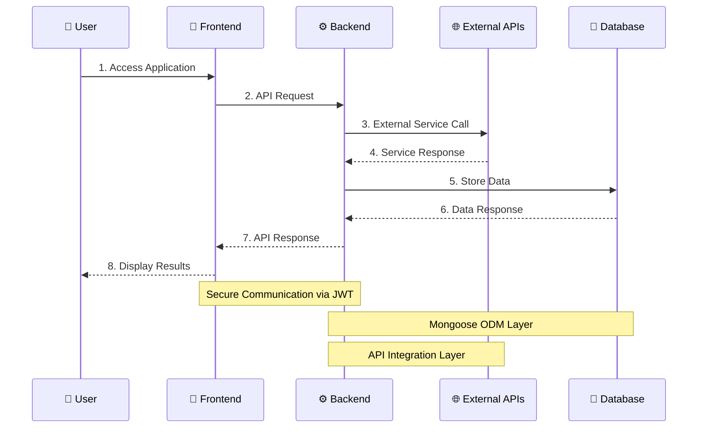

# Part-A-Docs
# DeepSeek Job Tracker - Part A Documentation

## Table of Contents
- [Project Management & Progress](#project-management--progress)
- [Project Overview](#project-overview)
- [Functionality & Features](#functionality--features)
- [Target Audience](#target-audience)
- [Tech Stack](#tech-stack)
- [Dataflow Diagram](#dataflow-diagram)
- [Application Architecture](#application-architecture)
- [User Stories](#user-stories)
- [Wireframes](#wireframes)

## Project Overview

DeepSeek Job Tracker is an AI-powered job application management platform designed to help professionals, especially those in career transition, effectively manage their job search process. The platform leverages artificial intelligence to analyze resumes and match them with suitable job opportunities.

### Purpose

The platform serves three main purposes:
1. Simplify the job application process through AI-driven insights
2. Provide intelligent job matching based on skills and experience
3. Offer comprehensive application tracking and management

### Target Audience

Our platform primarily targets:
- Career transition professionals
- Job seekers in the tech industry
- Professionals with diverse skill sets

## Tech Stack

### Frontend
- React.js
- Material UI
- TypeScript
- TailwindCSS
- Axios

### Backend
- Node.js
- Express.js
- MongoDB
- Mongoose
- JWT Authentication

### External APIs
- DeepSeek AI for resume analysis
- Brave Search API for job recommendations

### Deployment
- Railway (Backend)
- Vercel (Frontend)

## User Stories & Personas

### Career Transition Professional - Primary Persona

**Osman's Profile:**
- Background: Mechanical Engineering degree, recent IT Web Development
- Goals: Transition to tech industry
- Frustrations: Complex skill presentation challenges

### Initial User Stories

#### Guest User
* As a guest, I want to learn about the platform's features
* As a guest, I want to try basic resume analysis
* As a guest, I want to see example job matches
* As a guest, I want to create an account

#### Registered User
- As a registered user, I want to upload my resume
- As a registered user, I want to create my profile
- As a registered user, I want to find matched jobs for my resume
- As a registered user, I want to link my social and professional profiles
- As a registered user, I want to track my applications
- As a registered user, I want to get AI feedback
- As a registered user, I want to visit suggested job application links and apply
- As a registered user, I want to showcase my applied jobs on my personal website/portfolio

### Refined User Stories

After developing our primary persona, we refined our user stories:

#### Career Transition Focus
* As a career changer, I want my resume analyzed by AI so that I can effectively highlight my diverse educational background
* As a professional with varied experience, I want feedback on how to present my transferable skills from management to tech
* As a mature student, I want guidance on highlighting my recent tech education alongside my extensive work experience

### Application Screenshots

#### 1. Resume Upload Feature


**Özellik Açıklaması:** Özgeçmiş Yükleme ekranı, kullanıcıların özgeçmiş dosyalarını kolayca yüklemelerine olanak tanır. Arayüz, basit bir sürükle-bırak alanı sağlar ve yükleme durumunu başarılı olduğunda onay ile gösterir. Kullanıcılar daha sonra tek bir tıklama ile özgeçmişlerinin yapay zeka analizini görebilirler.

#### 2. Resume Analysis - Executive Summary


**Özellik Açıklaması:** Özgeçmiş Analizi ekranı, kullanıcının özgeçmişinin yapay zeka tarafından oluşturulan yönetici özetini sunar. Daha iyi görünürlük için önemli anahtar kelimeler turuncu renkte vurgulanarak, temel nitelikleri, deneyimleri ve becerileri vurgular. Bu, kullanıcılara özgeçmişlerinin potansiyel işverenler tarafından nasıl algılandığına dair hızlı bir genel bakış sağlar.

#### 3. Skills Breakdown and Recommendations


**Özellik Açıklaması:** Bu bölüm, kullanıcının becerilerinin yeterlilik seviyeleri (İleri, Orta) açıkça belirtilerek detaylı bir dökümünü sunar. Öneriler paneli, nicel başarılar ekleme ve beceri bölümünü belirli teknolojilerle geliştirme gibi özgeçmişi iyileştirmek için uygulanabilir tavsiyeler sunar.

#### 4. Areas of Improvement and Job Matching


**Özellik Açıklaması:** Platform, yazılım çeşitliliği ve sektör deneyimi gibi kullanıcının profilini geliştirebileceği belirli alanları tanımlar. İş Eşleştirme bölümü, yapay zeka analizine dayalı olarak kullanıcının profiline uyan pozisyonları gösterir ve tüm eşleşen pozisyonları görüntüleme veya daha fazla eşleşen iş bulma imkanı sunar.

#### 5. Job Matching Detail View


**Özellik Açıklaması:** İş Eşleştirme Detay Görünümü, kullanıcının özgeçmişine dayalı olarak eşleşen iş pozisyonlarının ayrıntılı bir listesini sunar. Her iş ilanı, pozisyon başlığı, şirket adı ve konum bilgilerini içerir. Kullanıcılar, "Apply&Track" düğmesini kullanarak doğrudan başvurabilir ve başvurularını platformda takip edebilirler. İş açıklamaları, kullanıcının becerileriyle eşleşen anahtar kelimeleri vurgular.

#### 6. Job Application Tracker - Calendar View


**Özellik Açıklaması:** İş Başvuru Takipçisi'ndeki Takvim Görünümü, kullanıcıların başvuru zaman çizelgelerini görselleştirmelerine olanak tanır. Başvurular, durumlarına göre (Başvuruldu, İnceleniyor, Mülakat vb.) renk kodludur, bu da birden fazla başvuruyu ve mülakatlar veya takipler gibi yaklaşan etkinlikleri takip etmeyi kolaylaştırır.

#### 7. Job Application Tracker - My Applications


**Özellik Açıklaması:** Başvurularım görünümü, tüm iş başvurularının mevcut durumları, başvuru tarihleri ve son güncellemeleriyle birlikte bir listesini sunar. Kullanıcılar başvuruları durumlarına göre filtreleyebilir ve farklı kriterlere göre sıralayabilirler. Her başvuru girişi, başvuru bağlantısını görüntüleme, durumu güncelleme veya girişi silme seçeneklerini içerir.

## Application Architecture

```mermaid
graph LR
    %% Define main components
    User((👤 User))
    Browser[🌐 Browser]
    
    subgraph ClientSide[Client Side]
        style ClientSide fill:#e8f5e9,stroke:#4caf50,stroke-width:2px
        React[React Framework]
        
        subgraph FrontendPackages[Third Party Packages]
            style FrontendPackages fill:#f3e5f5,stroke:#9c27b0,stroke-width:1px
            Packages[\"
                @mui/material
                @emotion/react
                @fullcalendar
                axios
                react-router-dom
                JWT management
            \"]
        end
    end
    
    subgraph ServerSide[Server Side]
        style ServerSide fill:#ffebee,stroke:#f44336,stroke-width:2px
        Express[Express Framework]
        
        subgraph BackendPackages[Third Party Packages]
            style BackendPackages fill:#e3f2fd,stroke:#2196f3,stroke-width:1px
            ServerPackages[\"
                express
                mongoose
                multer
                bcryptjs
                jsonwebtoken
                pdf-parse
            \"]
        end
    end
    
    subgraph ExternalAPIs[External APIs]
        style ExternalAPIs fill:#fff3e0,stroke:#ff9800,stroke-width:2px
        APIs[\"
            OpenAI - Resume Analysis
            DeepSeek - AI Processing
            Jooble - Job Search
        \"]
    end
    
    subgraph Database[Database Layer]
        style Database fill:#fce4ec,stroke:#e91e63,stroke-width:2px
        MongoDB[(MongoDB Atlas)]
    end
    
    %% Define connections with labels
    User -->|Web Address| Browser
    Browser -->|HTTP Request| ClientSide
    ClientSide -->|API Request| ServerSide
    ServerSide -->|API Response| ClientSide
    ServerSide -->|Mongoose Query| Database
    Database -->|Data| ServerSide
    ServerSide -->|API Requests| ExternalAPIs
    ExternalAPIs -->|API Response| ServerSide
    Browser -->|HTML/JSON| User

    %% Style nodes
    style User fill:#bbdefb,stroke:#1976d2,stroke-width:2px
    style Browser fill:#c8e6c9,stroke:#388e3c,stroke-width:2px
    style React fill:#b2dfdb,stroke:#00796b,stroke-width:2px
    style Express fill:#ffcdd2,stroke:#d32f2f,stroke-width:2px
    style MongoDB fill:#f8bbd0,stroke:#c2185b,stroke-width:2px
```

### System Components

#### User Layer
- Web browser access
- User interface interaction
- Form submissions and file uploads

#### Client Side (Frontend)
- **Framework**: React
- **Key Features**:
  - Responsive UI with Material-UI
  - State management
  - Route handling
  - API integration
  - File upload handling
  - Real-time updates

#### Server Side (Backend)
- **Framework**: Express.js
- **Key Features**:
  - RESTful API endpoints
  - Authentication & Authorization
  - File processing
  - Data validation
  - Error handling
  - External API integration

#### Database Layer
- **Technology**: MongoDB Atlas
- **Features**:
  - Cloud hosting
  - Scalable storage
  - Data redundancy
  - Automated backups
  - Security compliance

#### External Services
- **OpenAI API**: Resume analysis and skill extraction
- **DeepSeek API**: Advanced AI processing
- **Jooble API**: Job search and listings

## Data Flow Diagram



## Future Development Plans

### Immediate Goals
1. Complete core functionality
   - Resume analysis
   - Job matching
   - Application tracking

### Future Expansion
1. Local Partnerships
   - Collaboration with Melbourne and Sydney job agencies
   - Specialized portals for local opportunities

2. Industry Specialization
   - Partnerships with tech companies
   - Custom AI analysis for specific sectors

3. Community Features
   - Mentorship opportunities
   - Success stories
   - Career transition guides
## Trello Board
Our Trello board can be viewed [here](https://trello.com/b/TIJBsAuq/careerlens).

---

# 🚀 CareerLens Project

Welcome to CareerLens - Your AI-Powered Career Companion! 🌟

## 📚 Project Overview

This document provides a comprehensive overview of the CareerLens project, detailing the libraries and dependencies used, project management methodologies, and testing strategies implemented throughout the development process.

---

## 🛠️ Libraries & Dependencies

### 🎨 Frontend (Client)

- **@emotion/react, @emotion/styled**: These libraries are used for CSS-in-JS styling, allowing dynamic and scoped styling within React components.

- **@fullcalendar/daygrid, @fullcalendar/interaction, @fullcalendar/react**: These libraries provide interactive calendar functionalities, enabling users to track job application timelines visually.

- **@mui/icons-material, @mui/material**: Material UI libraries used for creating a consistent, responsive, and visually appealing user interface with pre-built React components and icons.

- **axios**: A promise-based HTTP client used to handle API requests between the frontend and backend, supporting asynchronous operations with async/await syntax.

- **dotenv**: Allows the frontend to securely manage environment variables, such as API endpoints, without exposing sensitive information.

- **react, react-dom**: Core libraries for building the frontend application using React, enabling component-based architecture and efficient DOM manipulation.

- **react-router-dom**: Enables client-side routing, allowing the application to behave as a single-page application (SPA) with dynamic navigation between different views.

- **react-scripts**: Provides scripts and configurations for running, building, and testing the React application, included by default with Create React App.

---

### ⚙️ Backend (Server)

- **express**: A minimal and flexible Node.js web application framework used to build the backend API, handling HTTP requests and responses efficiently.

- **axios**: Used on the backend to make external API calls (e.g., OpenAI, DeepSeek, Jooble APIs) for resume analysis and job search functionalities.

- **bcryptjs**: Provides hashing functionality for securely storing user passwords in the database.

- **cors**: Enables Cross-Origin Resource Sharing, allowing the frontend application to communicate securely with the backend API from different origins.

- **dotenv**: Manages environment variables securely, storing sensitive information such as API keys, database URIs, and JWT secrets.

- **jsonwebtoken**: Implements JSON Web Tokens (JWT) for secure user authentication and authorization.

- **mongoose**: An Object Data Modeling (ODM) library for MongoDB, used to define schemas, manage database interactions, and perform CRUD operations.

- **multer**: Middleware for handling multipart/form-data, primarily used for uploading resume files (PDF, DOC, DOCX).

- **pdf-parse**: Extracts text content from uploaded PDF resumes, enabling further analysis through external APIs.

- **nodemon** (dev dependency): Automatically restarts the server during development upon detecting file changes, improving development efficiency.

---

### 🌐 External APIs & Services

- **OpenAI API**: Used for advanced resume analysis, providing detailed insights, strengths, weaknesses, and recommendations based on resume content.

- **DeepSeek API**: An alternative AI-powered resume analysis service, offering comprehensive resume evaluations and job matching suggestions.

- **Jooble API**: Integrated for job search functionality, allowing users to find relevant job listings based on their resume analysis results.

---

## 📋 Project Management & Task Delegation Methodology

We utilized Discord as our primary communication platform, conducting daily audio calls and screen-sharing sessions to facilitate real-time collaboration and debugging. This approach allowed us to quickly identify and resolve issues, significantly enhancing productivity.

For task management, we adopted a Kanban methodology using Trello. Our Kanban board initially included columns for:

- 📝 Requirements (Part A & Part B)
- 🔍 Research
- 🎯 Presentations
- 📖 User Stories
- 📊 Backlog
- ✅ To Do
- 🔄 Doing
- 🧪 Testing
- ✨ Completed

As the project progressed, completed columns such as Requirements, Research, Presentations, and User Stories were archived to maintain clarity. Tasks were labeled based on estimated completion time and categorized as either frontend or backend tasks.

Daily stand-up meetings were held each morning to discuss daily goals, followed by check-ins before lunch and at the end of the day to monitor progress and address any blockers. Our Kanban approach emphasized continuous delivery, allowing us to deploy features incrementally as they became ready.

---

## 🧪 Testing Strategy

### 🎯 Frontend Testing

- **Manual Testing**: Extensive manual testing was conducted by team members, family, and friends to ensure usability, responsiveness, and functionality across various devices and browsers.

- **Integration Testing**: Axios interceptors and API response validations were implemented to ensure robust error handling and reliable communication between frontend and backend services.

### ⚡ Backend Testing

- **Manual Testing**: Postman was extensively used to test API endpoints, ensuring correct responses, error handling, and data integrity.

- **Unit & Integration Testing**: Mocha and Chai were utilized to write comprehensive unit and integration tests for backend routes, middleware, and database interactions, ensuring reliability and stability.

### 🔄 End-to-End Testing

- **User Acceptance Testing (UAT)**: Conducted by external users (friends and family) to validate the overall user experience, identify usability issues, and gather feedback for improvements.

- **Continuous Integration & Deployment (CI/CD)**: Although not fully automated, manual deployment processes were regularly performed to ensure the application remained stable and functional in production environments.

---

## ✨ Application Features & Functionalities

### 🔐 User Authentication & Authorization

- Secure user registration and login using JWT authentication.
- Password hashing with bcryptjs for enhanced security.
- Protected routes and middleware to ensure authorized access to sensitive data.

### 📄 Resume Upload & Analysis

- File upload functionality supporting PDF, DOC, and DOCX formats.
- Text extraction from resumes using pdf-parse.
- AI-powered resume analysis via OpenAI and DeepSeek APIs, providing detailed insights, strengths, weaknesses, and actionable recommendations.

### 🔍 Job Search & Matching

- Integration with Jooble API to fetch relevant job listings based on resume analysis results.
- Advanced search capabilities allowing users to refine job searches by keywords, location, and skills.

### 📊 Application Tracking & Management

- Comprehensive application tracking system enabling users to manage job applications, update statuses, and add notes.
- Interactive calendar view (FullCalendar) for visualizing application timelines and upcoming events.

### 🎨 User Interface & Experience

- Responsive and intuitive UI built with React and Material UI.
- Consistent design language and interactive components enhancing user engagement.
- Smooth animations, transitions, and visual feedback for improved usability.

---

## 🚀 Deployment & Hosting

- **Frontend**: Deployed using Netlify, providing continuous deployment from GitHub repositories.
- **Backend**: Hosted on Render.com, offering reliable and scalable Node.js hosting with MongoDB integration.

---

## 🔮 Future Improvements & Enhancements

- 🔄 Implement automated CI/CD pipelines for streamlined deployment processes.
- 👤 Enhance user profile management, allowing users to update personal information and preferences.
- 🌐 Integrate additional job search APIs for broader job listing coverage.
- 🧪 Expand testing coverage with automated end-to-end tests using Cypress or Selenium.

---

## 👥 Contributors

- Osman Orka

---

## 📝 License

This project is licensed under the MIT License - see the LICENSE file for details.

---

Made with ❤️ by the CareerLens Team