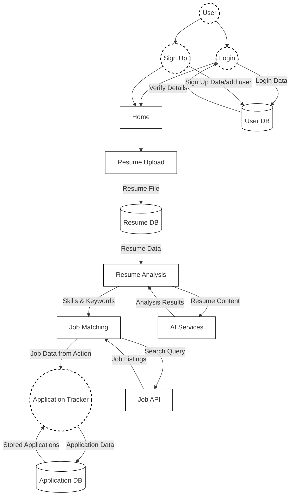

```mermaid
graph TD
    %% Main Entities and Processes
    User((User))
    Login((Login))
    SignUp((Sign Up))
    Home[Home]
    ResumeUpload[Resume Upload]
    ResumeAnalysis[Resume Analysis]
    JobMatching[Job Matching]
    ApplicationTracker((Application Tracker))
    
    %% Data Stores
    UserDB[(User DB)]
    ResumeDB[(Resume DB)]
    ApplicationDB[(Application DB)]
    
    %% External Entities
    AI[AI Services]
    JobAPI[Job API]
    
    %% Connections
    User --> Login
    Login -- Login Data --> UserDB
    UserDB -- Verify Details --> Login
    Login --> Home
    
    User --> SignUp
    SignUp -- Sign Up Data/add user --> UserDB
    SignUp --> Home
    
    Home --> ResumeUpload
    ResumeUpload -- Resume File --> ResumeDB
    ResumeDB -- Resume Data --> ResumeAnalysis
    
    ResumeAnalysis -- Resume Content --> AI
    AI -- Analysis Results --> ResumeAnalysis
    
    ResumeAnalysis -- Skills & Keywords --> JobMatching
    JobMatching -- Search Query --> JobAPI
    JobAPI -- Job Listings --> JobMatching
    
    JobMatching -- Job Data from Action --> ApplicationTracker
    ApplicationTracker -- Application Data --> ApplicationDB
    ApplicationDB -- Stored Applications --> ApplicationTracker
    
    %% Styling
    classDef process fill:#fff,stroke:#000,stroke-width:1px;
    classDef entity fill:#fff,stroke:#000,stroke-width:2px,stroke-dasharray: 5 5;
    classDef datastore fill:#fff,stroke:#000,stroke-width:1px;
    classDef external fill:#fff,stroke:#000,stroke-width:1px;
    
    class Home,ResumeUpload,ResumeAnalysis,JobMatching process;
    class User,Login,SignUp,ApplicationTracker entity;
    class UserDB,ResumeDB,ApplicationDB datastore;
    class AI,JobAPI external;
```