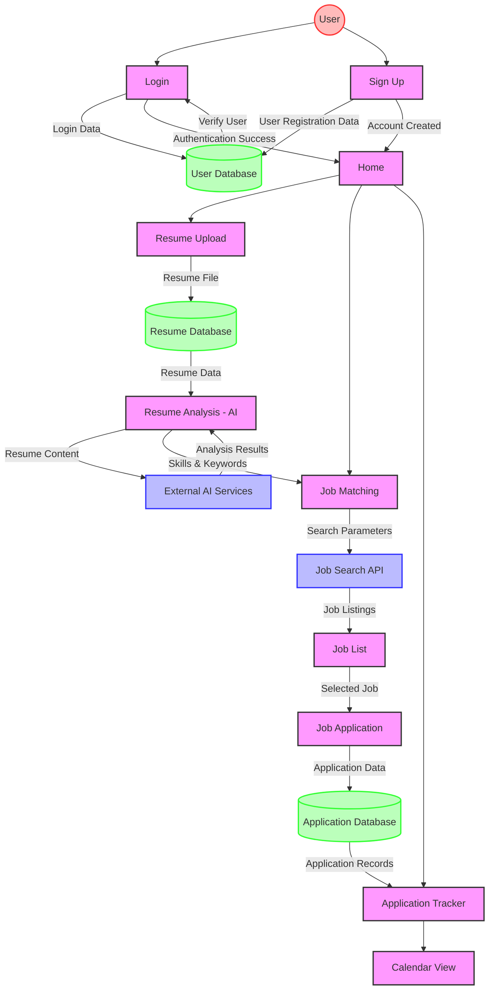

```mermaid
graph TD
    %% Main Entities
    User((User))
    Login[Login]
    SignUp[Sign Up]
    Home[Home]
    ResumeUpload[Resume Upload]
    ResumeAnalysis[Resume Analysis - AI]
    JobMatching[Job Matching]
    JobList[Job List]
    JobApplication[Job Application]
    ApplicationTracker[Application Tracker]
    Calendar[Calendar View]
    
    %% External Entities
    ExternalAI[External AI Services]
    JobAPI[Job Search API]
    
    %% Data Stores
    UserDB[(User Database)]
    ResumeDB[(Resume Database)]
    ApplicationDB[(Application Database)]
    
    %% Data Flows
    User --> Login
    User --> SignUp
    
    %% Login Flow
    Login -- Login Data --> UserDB
    UserDB -- Verify User --> Login
    Login -- Authentication Success --> Home
    
    %% Sign Up Flow
    SignUp -- User Registration Data --> UserDB
    SignUp -- Account Created --> Home
    
    %% Home Navigation
    Home --> ResumeUpload
    Home --> JobMatching
    Home --> ApplicationTracker
    
    %% Resume Flow
    ResumeUpload -- Resume File --> ResumeDB
    ResumeDB -- Resume Data --> ResumeAnalysis
    ResumeAnalysis -- Resume Content --> ExternalAI
    ExternalAI -- Analysis Results --> ResumeAnalysis
    ResumeAnalysis -- Skills & Keywords --> JobMatching
    
    %% Job Matching Flow
    JobMatching -- Search Parameters --> JobAPI
    JobAPI -- Job Listings --> JobList
    JobList -- Selected Job --> JobApplication
    
    %% Application Tracking Flow
    JobApplication -- Application Data --> ApplicationDB
    ApplicationDB -- Application Records --> ApplicationTracker
    ApplicationTracker --> Calendar
    
    %% Styling
    classDef process fill:#f9f,stroke:#333,stroke-width:2px;
    classDef external fill:#bbf,stroke:#33f,stroke-width:2px;
    classDef datastore fill:#bfb,stroke:#3f3,stroke-width:2px;
    classDef entity fill:#fbb,stroke:#f33,stroke-width:2px;
    
    class Login,SignUp,Home,ResumeUpload,ResumeAnalysis,JobMatching,JobList,JobApplication,ApplicationTracker,Calendar process;
    class ExternalAI,JobAPI external;
    class UserDB,ResumeDB,ApplicationDB datastore;
    class User entity;
```