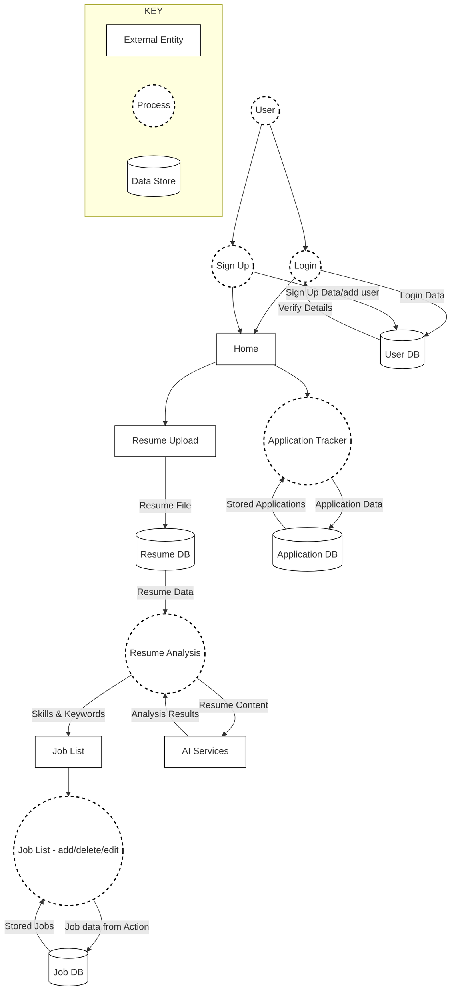

```mermaid
graph TD
    %% Main Entities
    User((User))
    Login((Login))
    SignUp((Sign Up))
    Home[Home]
    ResumeUpload[Resume Upload]
    ResumeAnalysis((Resume Analysis))
    JobList[Job List]
    JobListAction((Job List - add/delete/edit))
    ApplicationTracker((Application Tracker))
    
    %% Data Stores
    UserDB[(User DB)]
    ResumeDB[(Resume DB)]
    JobDB[(Job DB)]
    ApplicationDB[(Application DB)]
    
    %% External Entities
    AI[AI Services]
    ExternalEntity[External Entity]
    Process((Process))
    
    %% Connections - Login Flow
    User --> Login
    Login -- Login Data --> UserDB
    UserDB -- Verify Details --> Login
    Login --> Home
    
    %% Connections - Sign Up Flow
    User --> SignUp
    SignUp -- Sign Up Data/add user --> UserDB
    SignUp --> Home
    
    %% Connections - Resume Flow
    Home --> ResumeUpload
    ResumeUpload -- Resume File --> ResumeDB
    ResumeDB -- Resume Data --> ResumeAnalysis
    ResumeAnalysis -- Resume Content --> AI
    AI -- Analysis Results --> ResumeAnalysis
    ResumeAnalysis -- Skills & Keywords --> JobList
    
    %% Connections - Job Flow
    JobList --> JobListAction
    JobListAction -- Job data from Action --> JobDB
    JobDB -- Stored Jobs --> JobListAction
    
    %% Connections - Application Flow
    Home --> ApplicationTracker
    ApplicationTracker -- Application Data --> ApplicationDB
    ApplicationDB -- Stored Applications --> ApplicationTracker
    
    %% Key Section
    subgraph KEY
        ExternalEntity
        Process
        DataStore[(Data Store)]
    end
    
    %% Styling
    classDef process fill:#fff,stroke:#000,stroke-width:1px;
    classDef entity fill:#fff,stroke:#000,stroke-width:2px,stroke-dasharray: 5 5;
    classDef datastore fill:#fff,stroke:#000,stroke-width:1px;
    classDef external fill:#fff,stroke:#000,stroke-width:1px;
    
    class Home,ResumeUpload,JobList process;
    class User,Login,SignUp,ResumeAnalysis,JobListAction,ApplicationTracker,Process entity;
    class UserDB,ResumeDB,JobDB,ApplicationDB,DataStore datastore;
    class AI,ExternalEntity external;
```